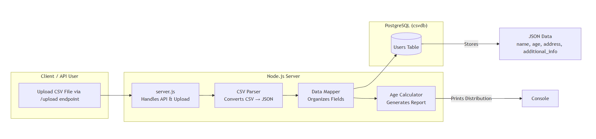

# CSV → JSON Converter API

A Node.js + PostgreSQL API that uploads a CSV file, converts it to JSON (using custom parsing — no CSV libraries), stores it in the database, and prints an **age group distribution** report.


---

##  Tech Stack
**Node.js (Express)** • **PostgreSQL** • **dotenv** • **Custom CSV Parser**

---

##  Database Schema

```sql
CREATE TABLE public.users (
  id SERIAL PRIMARY KEY,
  name VARCHAR NOT NULL,
  age INT NOT NULL,
  address JSONB,
  additional_info JSONB
);


## How to Run
git clone https://github.com/IqraShaikh1/KELP_API_CHALLENGE.git
cd KELP_API_CHALLENGE
npm install


Create a .env file:

PORT=3000
DB_USER=postgres
DB_PASSWORD=yourpassword
DB_HOST=localhost
DB_PORT=5432
DB_DATABASE=csvdb

Start server:

node server.js


Upload CSV:

curl -X POST -F "file=@uploads/sample_users.csv" http://localhost:3000/upload

